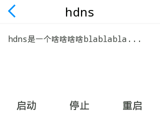

# Modou TP API


But we did. :D

## 什么是魔豆触屏 API

其实大家所看到的屏幕上的应用，都是一个个的可执行程序，他们都被存放在 `/system/apps/tp/bin` 下

目前，我们已经开放的触屏应用及组件有

- 万能 app `custom`，快速定制触屏应用
- 消息对话框组件 `messagebox`
- 图片查看器组件 `imageview`

## 触屏应用示例

- [背光控制](https://github.com/modouwifi/backlight-control)
- [Modou Love](http://bbs.modouwifi.cn/thread-7223-1-1.html)

## 触屏 API 列表及其说明

### 万能 app: `custom`

我们尝试在命令行下执行它：

    $ custom

得到的输出是：

```
(1959.710280)/mem/mochui-rom/mochui-sys/microwin/src/mochui/custom.c-309: Wrong arguments!
custom json_config_file
```

hmm... 有点意思。这个 `json_config_file` 又是什么呢？我们发现 `/system/apps/tp/conf/custom.conf` 这个文件，内容如下：

```json
{
  "title" : "hdns",
  "content" : "hdns是一个啥啥啥啥blablabla...",
  "button1" : {
    "txt" : "启动",
    "cmd" : "/data/apps/hdns/sbin/hdns.sh start",
    "code" : {
      "0" : "执行成功",
      "1" : "执行错误1",
      "2" : "执行错误2"
    }
  },

  "button2" : {
    "txt" : "停止",
    "cmd" : "/data/apps/hdns/sbin/hdns.sh stop",
    "code" : {
      "0" : "服务已经停止",
      "1" : "执行错误1",
      "2" : "执行错误2"
    }
  },

  "button3" : {
    "txt" : "重启",
    "cmd" : "/data/apps/hdns/sbin/hdns.sh restart",
    "code" : {
      "0" : "已经重启",
      "1" : "执行错误1",
      "2" : "执行错误2"
    }
  }
}
```

Bingo! 所以呢，我们尝试性地敲下：

    $ custom /system/apps/tp/conf/custom.conf

结果呢屏幕上出现了什么？？



这个时候再回头去看 `/system/apps/tp/conf/custom.conf` 的内容，大家明白了么？ XD


6.22 版本后custom支持了些新的特性配置
- 新的脚本执行后返回字符串的方式。
   可以在脚本执行的过程中产生输出文本到某一个文件中，然后让custom程序从这个文件中读取字符串，然后显示在屏幕上，替代之前用不同code值对应不同返回文本的方式，这种方式会更灵活。

```json
{
  "title" : "hdns",
  "content" : "静态初始化文字",
  "dynmic-content" : {
    "cmd" : "ls",
    "code" : {
      "0" : "可以针对某个脚本的不同返回值返回不同的初始化文字",
      "1" : "text2",
      "2" : "text3"
     },
     "out_file" : "/etc/passwd"
   },   
  "button1" :   {
    "txt" : "启动",
    "cmd" : "/data/apps/hdns/sbin/hdns.sh start",
    "code" : {
      "0" : "执行成功",
      "1" : "执行错误1",
      "2" : "执行错误2"
    },
    "out_file" : "/etc/passwd"
  }
}


- 支持配置文件reload接口。
  在使用过程中，可以修改conf文件，然后给运行的custom进程发送SIGUSR1信号，custom进程就会重新载入配置文件，这种机制可以用来提供动态的界面变化，比如点击“打开”按钮后，这个按钮就会被替换为”关闭“，提供更友好的界面。

    kill -SIGUSR1 pid

这些新的特性的使用可以参考 modou-samba-0.3应用，这些新特性也是应modou-samba-0.3的作者junjian要求而加。    


### 消息对话框组件 `messagebox`

在 shell 下执行：

    $ messagebox

输出为：

```
(110177.570320)/mem/mochui-rom/mochui-sys/microwin/src/mochui/messagebox.c-189: Wrong arguments!
messagebox title content 1 ok_text ok_cmd
messagebox title content 2 no_text no_cmd yes_text yes_cmd
```

### 图片查看器组件 `imageview`

同样地，我们先尝试在 shell 下执行：

    $ imageview

得到输出为：

```
(103230.240260)/mem/mochui-rom/mochui-sys/microwin/src/mochui/imageview.c-98: Wrong arguments
imageview path-to-image-file image-width image-height
```


### 文字输出插件 'textview'
执行 textview 会有提示输出

    textview title content
    textview title content loop-interval(ms) loop-count loop-cmd ret-file

这是textview的两种使用方式:

第一种是静态的显示方式，只需要指定标题和文字，点击界面左上角箭头可以退出应用。

第二种可以用来显示动态的问题，如倒计时的动态文字，参数解释如下

- title             标题
- content           内容
- loop-interval     以什么样的频率去循环执行脚本（单位毫秒）
- loop-count        共循环执行脚本多少次(如果为0，表示无限次)
- loop-cmd          执行的脚本名字，其中可以使用%LOOP_COUNT%关键字，表示当前的循环次数
- ret-file          每次脚本执行结束后，textview会从这个文件中读取文本用来显示

这个控件略显复杂，下面给出一个示例
textview WPS连接 "" 1000 31 "/data/loop.sh %LOOP-COUNT% >/tmp/out" /tmp/out

loop.sh 的内容

    #!/bin/sh
    var=`expr 31 - $1`
    echo 请在 $var 秒内按下设备上的wps键，如果已经连接成功，可以选择退出

这样每隔一秒中都会执行一次loop.sh,每次传入的参数就是当前的循环次数,最后动态的文字都会被输出到/tmp/out,然后textview动态读入/tmp/out，这样就实现了文字的动态显示(动态的倒计时文字）


### 文字输入控件 input-text
在shell里执行input-text,会有提示
    inputtext default-text prompt-text write-to-file min-lin max-len


- default-text       输入法界面出现的时候，默认已经输入的文字
- prompt-text        输入法界面的提示文字
- write-to-file      输入成功后将输入文字写入到这个文件中
- min-lin            输入文字的最小长度限制
- max-len            输入文字的最大长度限制
