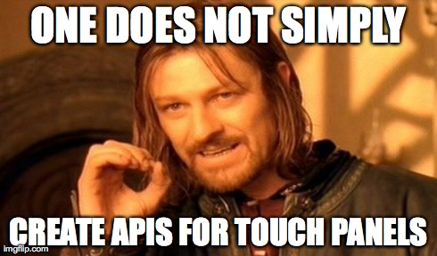

# Modou TP API



But we did. :D

## 什么是魔豆触屏 API

其实大家所看到的屏幕上的应用，都是一个个的可执行程序，他们都被存放在 `/system/apps/tp/bin` 下

目前，我们已经开放的触屏应用及组件有

- 万能 app `custom`，快速定制触屏应用
- 消息对话框组件 `messagebox`
- 图片查看器组件 `imageview`

## 万能 app: `custom`

我们尝试在命令行下执行它：

    $ custom

得到的输出是：

```
(1959.710280)/mem/mochui-rom/mochui-sys/microwin/src/mochui/custom.c-309: Wrong arguments!
custom json_config_file
```

hmm... 有点意思。这个 `json_config_file` 又是什么呢？我们发现 `/system/apps/tp/conf/custom.conf` 这个文件，内容如下：

```json
{
  "title" : "hdns",
  "content" : "hdns是一个啥啥啥啥blablabla...",
  "button1" : {
    "txt" : "启动",
    "cmd" : "/data/apps/hdns/sbin/hdns.sh start",
    "code" : {
      "0" : "执行成功",
      "1" : "执行错误1",
      "2" : "执行错误2"
    }
  },

  "button2" : {
    "txt" : "停止",
    "cmd" : "/data/apps/hdns/sbin/hdns.sh stop",
    "code" : {
      "0" : "服务已经停止",
      "1" : "执行错误1",
      "2" : "执行错误2"
    }
  },

  "button3" : {
    "txt" : "重启",
    "cmd" : "/data/apps/hdns/sbin/hdns.sh restart",
    "code" : {
      "0" : "已经重启",
      "1" : "执行错误1",
      "2" : "执行错误2"
    }
  }
}
```

Bingo! 所以呢，我们尝试性地敲下：

    $ custom /system/apps/tp/conf/custom.conf

结果呢屏幕上出现了什么？？


这个时候再回头去看 `/system/apps/tp/conf/custom.conf` 的内容，大家明白了么？ XD

